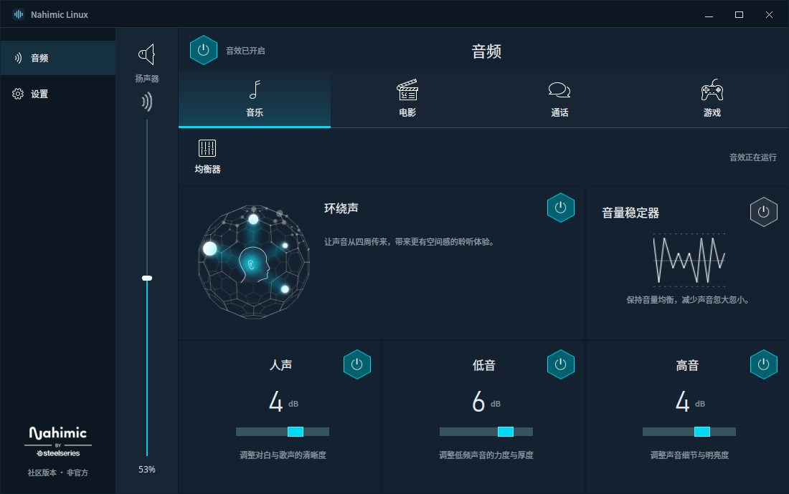

# Nahimic Linux

**English** | [简体中文](README.zh-CN.md)

Nahimic audio effects for laptop speakers on Linux. Includes Music, Movie, Gaming, and Communication profiles; bass, voice, and treble controls; surround sound; volume stabilization; and a ten-band equalizer. Switch between processed and original audio with one click. Volume stays in sync with the system, settings are saved automatically, and effects keep running after you close the panel.

This is an independent community project. It is not affiliated with, endorsed by, or sponsored by Nahimic, A-Volute, SteelSeries, or PC manufacturers. Names, trademarks, and original assets belong to their respective owners.

This repository is a fork of [wearzdk/nahimic-linux](https://github.com/wearzdk/nahimic-linux). The fork adds English as the source language and a hardware table so more codecs (starting with the Realtek ALC256) can be supported.



*Chinese interface shown. The app supports 12 interface languages and uses English by default for unsupported locales.*

## How it works

The effects are produced by the original Windows Nahimic APO4 audio engine, running under Wine inside a dedicated prefix. PipeWire sends speaker audio to that engine as 48 kHz stereo float PCM and plays the processed result on the real speaker output. Because the engine only sees PCM, it does not care which audio codec is in the laptop. What is hardware specific is:

1. **Detection:** which PipeWire sink counts as "the built-in speakers".
2. **Tuning:** the device settings file (`Devices/*_Speakers.nsx`) that the engine loads. The pinned download only contains the tuning for the original laptop (subsystem `1D05E022`).

Both are now defined in [host/devices.json](host/devices.json).

## Supported hardware

| Hardware | Codec | Subsystem | Tuning file | Status |
|---|---|---|---|---|
| MECHREVO Wujie 14X Pro (Senary) | `14f11f87` | `1d05e022` | factory `1D05E022_Speakers.nsx` | Verified upstream |
| Realtek ALC256 (any laptop) | `10ec0256` | any | borrowed `1D05E022_Speakers.nsx` | Experimental, untested |

Accepted speaker ports: `[Out] Speaker` (ALSA UCM) and `analog-output-speaker` (legacy PulseAudio profiles).

### Realtek ALC256 notes

- The ALC256 entry reuses the Senary laptop's speaker tuning. The effects (profiles, EQ, surround, stabilizer) should work, but the tuning was made for different speakers, so the sound may be too bright, too bassy, or quieter or louder than expected. Start with low bass gain.
- For the best result, use the tuning file made for your own laptop. If your laptop shipped with Nahimic on Windows, look in `C:\Windows\System32\DriverStore\FileRepository\` for a `*ProductSettings.cab` or a `Devices\<SUBSYSTEM>_Speakers.nsx` file, extract it, and point a local device entry at it (see below).
- Check your hardware first:

```sh
pactl --format=json list sinks | python3 -c "import json,sys; [print(s['name'], s['active_port'], s['properties'].get('alsa.components')) for s in json.load(sys.stdin)]"
```

You should see something like `HDA:10ec0256,<subsystem>,...` with the speaker port active.

### Adding or overriding a device locally

Create `~/.config/nahimic-linux/devices.json`. Entries there are checked before the built-in table:

```json
{
  "devices": [
    {
      "name": "My laptop (ALC256, own tuning)",
      "codec": "10ec0256",
      "subsystem": "1028087c",
      "device_file": "/home/me/nahimic/1028087C_Speakers.nsx",
      "verified": false
    }
  ],
  "speaker_ports": ["[Out] Speaker"]
}
```

`device_file` can be relative to the factory settings folder or an absolute path to your own file. The engine only imports tuning on first setup, so after changing it, reset the runtime (this also resets your effect settings):

```sh
systemctl --user stop nahimic.service
rm -rf ~/.local/share/nahimic-linux/runtime ~/.local/share/nahimic-linux/installation.json
nahimic --activate
```

## Install

On Arch Linux and derivatives, the AUR package installs the **upstream** project (which only supports the original laptop):

```sh
yay -S nahimic-linux
```

To use this fork (ALC256 support and English source), build it from this checkout. See "Build and install from source" below.

Requires x86_64 Linux, Wine, PipeWire, PipeWire Pulse, WirePlumber 0.5 or newer, and a systemd user session. The Qt interface works with KDE, GNOME, and other desktop environments that provide these components. Effects attach automatically to the built-in speakers while you select real output devices as usual. Headphones, Bluetooth devices, and HDMI outputs use their own audio paths. Effects resume automatically when the speakers return.

## Usage and troubleshooting

The power control at the top switches between audio effects and original audio. Open **Equalizer** for the ten-band controls, or **Settings** to configure startup and interface language. Changes appear immediately while the app applies and confirms them in the background. If a write fails, the panel reads the current state and displays an error.

The app uses a custom title bar: drag it to move the window, double-click to maximize or restore, and drag the window edges to resize.

Supported interface languages: English, Simplified Chinese, Traditional Chinese, Japanese, Korean, German, French, Spanish, Portuguese, Italian, Russian, and Turkish. The app follows the system language by default, with English used for unsupported locales. Translations are in [app/locales/](app/locales/); message keys are the English source strings.

```sh
nahimic --status
systemctl --user status nahimic.service
journalctl --user -u nahimic.service -b
```

A warning line `unverified hardware profile in use` in the journal is expected on ALC256. Settings are stored in `${XDG_DATA_HOME:-~/.local/share}/nahimic-linux/`.

## Build and install from source

Build dependencies: MinGW-w64 GCC, a C compiler, pkg-config, libpulse, Python, and cabextract. Runtime dependencies: Wine, PySide6, PipeWire, PipeWire Pulse, WirePlumber 0.5+, libpulse, and systemd.

```sh
make                                   # native host components
make DESTDIR=/tmp/nahimic-stage install  # inspect the layout
python -m unittest discover -s tests   # tests (QT_QPA_PLATFORM=offscreen on headless machines)
```

The runtime components (Nahimic engine and factory settings) are downloaded and SHA-256 verified by [packaging/PKGBUILD](packaging/PKGBUILD) and [packaging/extract_runtime.py](packaging/extract_runtime.py). To package this fork instead of upstream, change `url` in the PKGBUILD to this fork's repository and the `source` ref to the branch or tag you want to build, then run `makepkg -si` in the `packaging` folder.

## Contribute device support

Read [AGENTS.md](AGENTS.md) first. Include your laptop model, audio hardware IDs (`alsa.components`), PipeWire output information, and results from testing effect switching, settings persistence, service restarts, and continuous playback. Verify new device support on the actual machine before submitting a pull request.

## License and attribution

The community application and host code use the [MIT license](LICENSE). Downloaded runtime components retain their [upstream licensing terms](packaging/LicenseRef-Nahimic); original interface artwork is covered by its [attribution notice](app/assets/NOTICE.txt), not the community code's MIT license. Nahimic and other names and trademarks belong to their respective owners.
